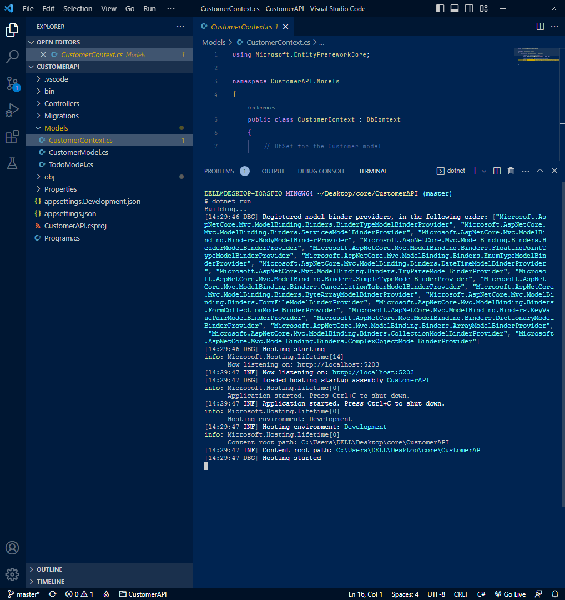
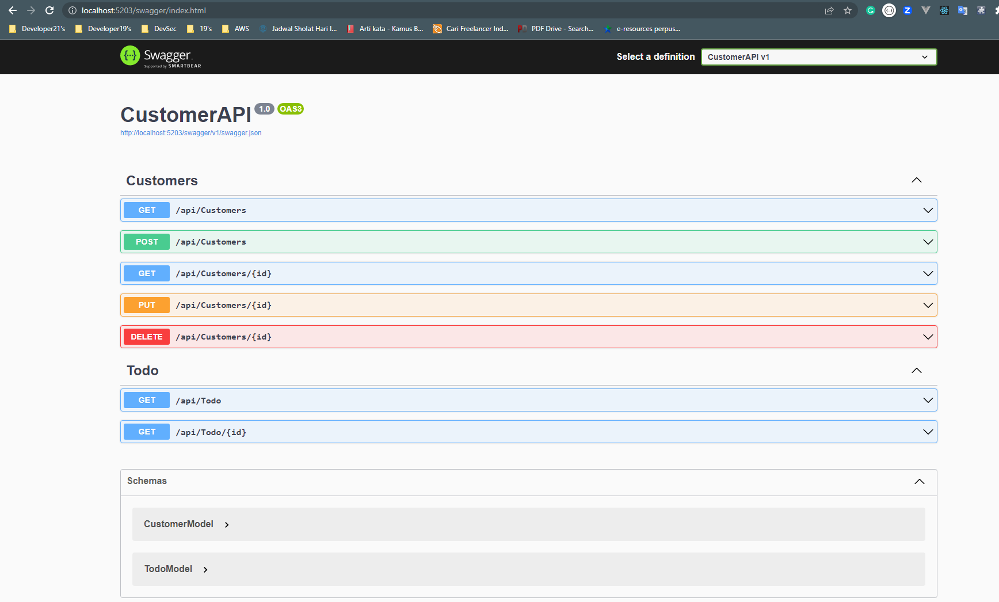
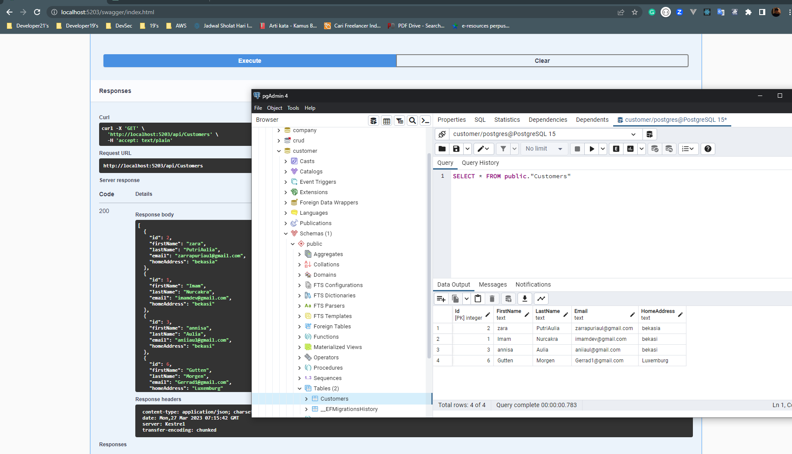
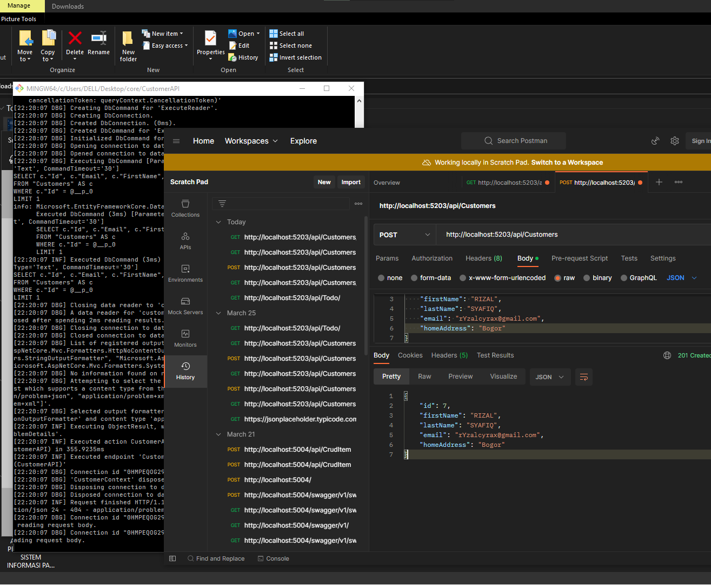
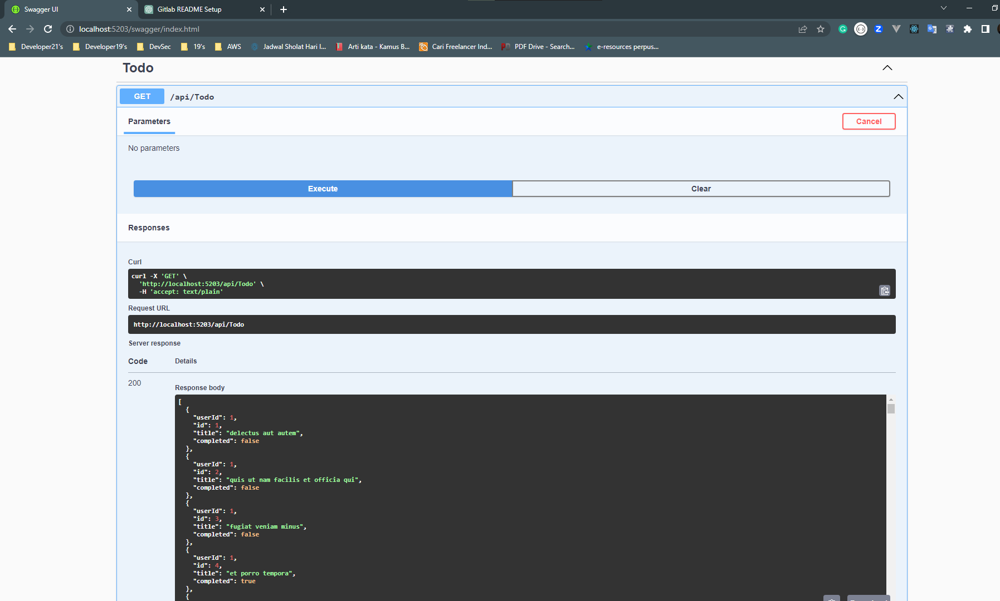
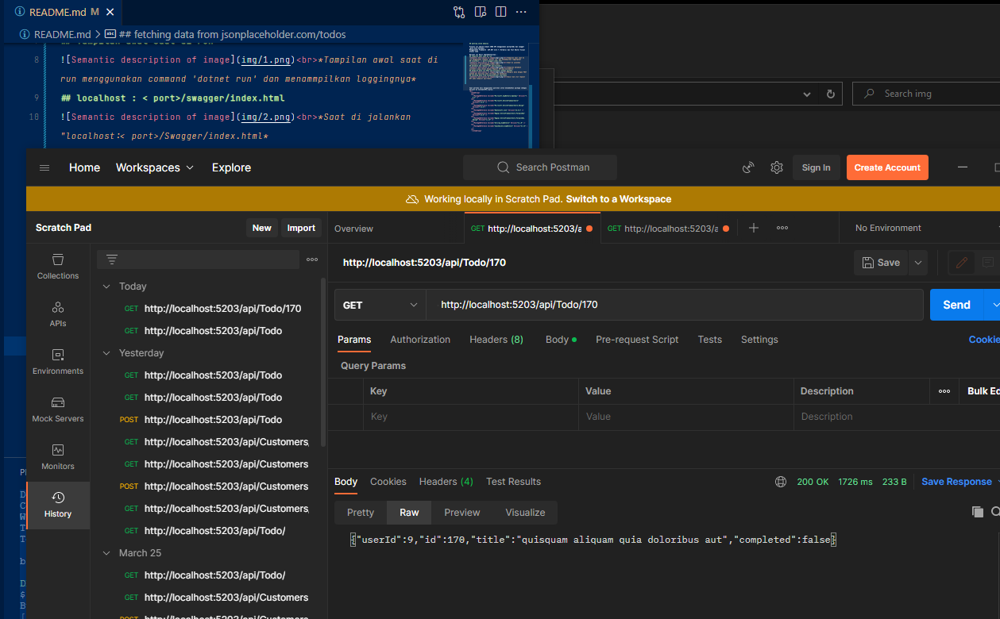

## penting untuk memulai

Project ini adalah Simple CRUD API menggunakan postgreSQL dan swagger(Bisa Pula Postman)
Menggunakan Framework  ASP.NET Core 7 (Terbaru) dan Text Editor Visual Studio Code

Berikut ini Hasil Implementasinya : 
## Tampilan awal saat di run 
 *Tampilan awal saat di run menggunakan command 'dotnet run' dan menammpilkan loggingnya*
## localhost : < port>/swagger/index.html
 *Saat di jalankan "localhost:< port>/Swagger/index.html*
## database dan request GET api/Customers 
 *Tampilan database Customers yang sesuai dengan Request GET/api/Customers*
## mengirim data via POST api/Customers dengan postman
 *Mengisi data dengan POST method dan hasilnya akan tersimpan ke database*
## fetching data from jsonplaceholder.com/todos
 *hasil dari hit request GET pada endpoint api/Todos*
## request GET by id 
 *request endpoint Todo by id*

Saat pertama kali menggunakan pastikan untuk menambahkan package sebagai berikut di CustomerAPI.csproj:
 
 `<ItemGroup>`
   
    `<PackageReference Include="Microsoft.AspNetCore.OpenApi" Version="7.0.3" />`
   
    `<PackageReference Include="Microsoft.EntityFrameworkCore" Version="7.0.4" />`
   
    `<PackageReference Include="Microsoft.EntityFrameworkCore.Design" Version="7.0.4">`
   
    `<PackageReference Include="Newtonsoft.Json" Version="13.0.3" />`
   
    `<PackageReference Include="Npgsql.EntityFrameworkCore.PostgreSQL" Version="7.0.3" />`
   
    `<PackageReference Include="Npgsql.EntityFrameworkCore.PostgreSQL.Design" Version="1.1.0" />`
   
    `<PackageReference Include="Serilog.AspNetCore" Version="6.1.0" />`
   
    `<PackageReference Include="Swashbuckle.AspNetCore" Version="6.4.0" />`
   
  `</ItemGroup>`
